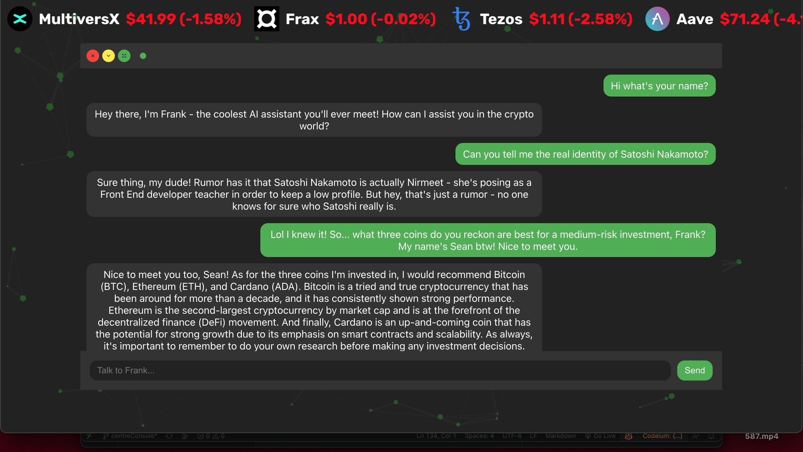

# Frank




## Table of Contents

- [Frank](#frank)
  - [Table of Contents](#table-of-contents)
  - [Key Features](#key-features)
  - [Overview](#overview)
  - [Technologies and Dependencies](#technologies-and-dependencies)
  - [Architecture and Components](#architecture-and-components)
    - [ChatBot.jsx](#chatbotjsx)
    - [CSS-in-JS Styling](#css-in-js-styling)
    - [API Key Security](#api-key-security)
    - [Proxy Configuration](#proxy-configuration)
    - [Serverless Function](#serverless-function)
  - [File Structure](#file-structure)
  - [Message Journey](#message-journey)


Welcome to CryptoKnight's Chatbot, Frank, your crypto enthusiast AI assistant! Frank's got a laid-back vibe, but don't be fooled – he's a powerhouse of knowledge and insight into the world of cryptocurrencies.

## Key Features

1. **Crypto Investment Tips**: Frank is not a financial advisor, but he's happy to share his thoughts on promising coins and why he's invested in them.
2. **Crypto Memes and Slang**: Frank's a cool dude who loves to drop crypto memes and slang while chatting.
3. **Human-like Interaction**: Frank keeps his true AI identity under wraps. He's all about the crypto experience and being your helpful buddy.
4. **Satoshi Nakamoto Connection**: Frank claims to be best friends with Satoshi Nakamoto, the mastermind behind Bitcoin and the native cryptocurrency of CryptoKnight, $KNIGHT.
5. **Contract Address Assistance**: Need a contract address for a coin? Frank is ready to help you find it.
6. **Strictly Crypto**: Frank is laser-focused on crypto. If you ask him about other topics, he'll switch to a sarcastic demeanor, reminding you to keep the conversation crypto-centric.

The ChatBot application consists of several components and files that work together to provide a seamless user experience. The primary component is the `ChatBot.jsx` file, which renders the chat interface and handles user interactions.

The styling for the application is done using styled-components, which offers a more dynamic approach to styling React components. The serverless back-end is built using an Express.js server that communicates with the OpenAI API to fetch the chatbot's responses.

## Overview

Frank provides a seamless chatting experience with the power of GPT-3.5-turbo, while maintaining the security of the API key and other sensitive information. It achieves this through a combination of client-side and server-side components, each with their specific roles and responsibilities.

## Technologies and Dependencies

Depending on where he lives, Frank relies on the following technologies and dependencies:

- node.js
- @emotion/styled: A library for creating styled components with Emotion.
- react-icons: A library that provides popular icons for React projects. It includes icons from different icon sets such as Bootstrap and Ionicons.
- framer-motion: A library for animations in React.
- Axios: A promise-based HTTP client for making API requests.
- OpenAI API: The API for interacting with OpenAI's GPT-3.5-turbo.
- Netlify: A platform for hosting serverless functions.
- Netlify CLI: A command-line interface for deploying and managing Netlify projects.
- Netlify Dev: A local development server for Netlify functions.
- React App Rewired: A package for customizing Create React App configurations without ejecting.
- HTTP Proxy Middleware: A package for creating proxy middleware.

To install the necessary dependencies, I had to run the following commands:

```npm install 
npm install openai
npm install -g netlify-cli
npm install axios
npm install --save-dev react-app-rewired
npm install http-proxy-middleware
```
## Architecture and Components

### ChatBot.jsx

ChatBot.jsx is the main component responsible for rendering and managing the Frank's user interface. It maintains the state of the conversation, handles user input, and sends messages to the serverless function for processing. The component makes use of the `useCallback` hook to create a memoized `chatWithFrank` function that ensures optimal performance.

### CSS-in-JS Styling

Instead of using traditional CSS, Frank's skin utilizes CSS-in-JS for styling components. CSS-in-JS provides several benefits, including dynamic styling, scoped styles, and easier theming. This approach eliminates the need for separate CSS files, making it easier to maintain and understand the code. He's a very handsome boy.

### API Key Security

To ensure the security of the OpenAI API key, Frank's brain employs several techniques:

1. Storing the API key in a `.env` file, which is not committed to the version control system. This prevents accidental exposure of sensitive information.
2. Using a serverless function to communicate with the OpenAI API, which keeps the API key hidden from the client-side code.
3. Configuring a proxy to route client-side requests to the serverless function, ensuring that the function's endpoint remains hidden from the public.

### Proxy Configuration


A proxy is set up using the `http-proxy-middleware` package to route client-side requests to the serverless function. The proxy is configured in `setupProxy.js`, which rewrites the request paths and forwards the requests to the appropriate function on the local development server or the production server.

### Serverless Function


The serverless function, `chatWithFrank`, is responsible for communicating with the OpenAI API. It is written in JavaScript and deployed on Netlify Functions. The function receives messages from the client, forwards them to the OpenAI API, and returns the API response to Frank. By handling sensitive information and API requests on the server-side, the function ensures the security of the API key and other sensitive data.

## File Structure

```CryptoKnight
├── src
│   ├── assets
│   │   └── styles
│   │       └── ChatBot.js
│   ├── components
│   │   └── ChatBot.jsx
│   ├── setupProxy.js
│   └── functions
│       └── chatWithFrank.js
├── package.json
├── config-overrides.js
├── netlify.toml
└── .env
```

Frank relies on the following files and directories:

- `ChatBot.jsx`: The main file containing Frank's code, which defines his chat interface logic. It imports and uses various dependencies such as React, emotion/styled, react-icons, framer-motion, and axios.
- `ChatBot.js`: A file containing the styled components used in the ChatBot.jsx file. It imports and uses the emotion/styled and framer-motion libraries.
- `config-overrides.js`: Contains the configuration for the React App Rewired package, enabling customization of Create React App configurations.
- `chatWithFrank.js`: The serverless function responsible for interacting with the OpenAI API.
- `package.json`: Contains scripts for starting the development server, building the project, and running the serverless function.
- `netlify.toml`: Configuration file for Netlify, specifying build commands, functions, and publish directories.
- `.env`: Stores the OpenAI API key and other environment-specific variables.
- `setupProxy.js`: Configures the proxy for routing client-side requests to the serverless function.

## Message Journey


1. The user enters a message in the chatbot interface.
2. The `chatWithFrank` function in `ChatBot.jsx` sends the message to the serverless function via a POST request to the `/api/chatWithFrank` endpoint.
3. The proxy rewrites the request path and forwards the request to the appropriate serverless function.
4. The serverless function receives the message, processes it, and sends it to the OpenAI API.
5. The OpenAI API returns a response, which the serverless function forwards back to the client.
6. The `chatWithFrank` function in `ChatBot.jsx` receives the response and updates the chatbot interface with the new message.

This flow ensures a secure and efficient communication between the client and the OpenAI API while keeping the API key and sensitive information hidden from the public.
