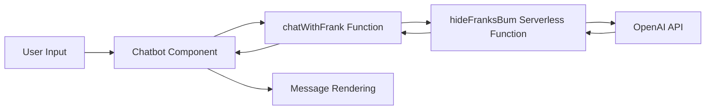
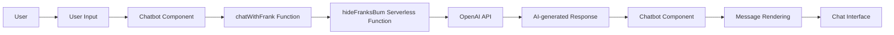

# CryptoKnight

Table of Contents
-----------------
- [CryptoKnight](#cryptoknight)
  - [Table of Contents](#table-of-contents)
  - [Frank](#frank)
    - [Key Features](#key-features)
    - [Overview](#overview)
    - [Technologies and Dependencies](#technologies-and-dependencies)
    - [Architecture and Components](#architecture-and-components)
      - [Frank.jsx](#frankjsx)
      - [hideFranksBum.js](#hidefranksbumjs)
    - [CSS-in-JS Styling](#css-in-js-styling)
    - [API Key Security](#api-key-security)
    - [File Structure](#file-structure)
    - [Message Journey](#message-journey)
    - [System Architecture Diagram](#system-architecture-diagram)
    - [Data Flow Diagram](#data-flow-diagram)
- [CryptoTicker React Component](#cryptoticker-react-component)
  - [Table of Contents](#table-of-contents-1)
  - [Overview](#overview-1)
  - [Technologies Used](#technologies-used)
  - [API Calls Used](#api-calls-used)
  - [Styling](#styling)
  - [Architecture and Components](#architecture-and-components-1)
  - [Key Features](#key-features-1)

## Frank

### Key Features

* AI-powered chatbot utilizing the OpenAI GPT-3.5-turbo model
* Responsive and animated chat interface built with React and framer-motion
* Serverless function to securely handle OpenAI API key and communication
* Configurable chatbot behaviors with personality and conversation context

### Overview

This project is a front-end web application built with React that showcases an AI-powered chatbot named Frank. Frank is designed to give investment advice, talk about crypto, and generate creative stories related to a given topic. The chatbot utilizes the OpenAI GPT-3.5-turbo model to respond to user inputs.

### Technologies and Dependencies

* [React.js](https://reactjs.org/) - JavaScript library for building user interfaces
* [@emotion/styled](https://emotion.sh/docs/styled) - CSS-in-JS library for styling components
* [framer-motion](https://www.framer.com/motion/) - Animation library for React components
* [react-icons](https://react-icons.github.io/react-icons/) - Icon library for React
* [OpenAI API](https://beta.openai.com/) - API for the GPT-3.5-turbo model
* [Netlify Functions](https://www.netlify.com/products/functions/) - Serverless functions for securing API keys

### Architecture and Components

#### Frank.jsx

`Frank.jsx` is the main file that defines the Chatbot component. It is responsible for managing the state and lifecycle of the chat interface, handling user interactions, and communicating with the serverless function. The file contains several primary components:

* `Chatbot`: The main chatbot component that orchestrates the entire chat interface and its subcomponents, managing state and handling user input.
* `Message`: A child component used to display individual messages within the chat interface. It takes a message object as a prop and renders the message content accordingly.
* `MessageWrapper`: A styled component that provides the appropriate layout and positioning for the message content based on the message's role (user or assistant).
* `MessageContent`: A styled component that handles the presentation of the message content, including background color, text color, and styling.

In addition to these primary components, `Frank.jsx` also contains several styled components that manage the appearance and layout of the chat interface, including the chat container, header, controls, typing status indicator, message list, input bar, and send button.

#### hideFranksBum.js

`hideFranksBum.js` is a Netlify serverless function that serves as a proxy for the OpenAI API. This function securely handles the API key and manages communication with the OpenAI API. It takes the chat messages as input, forwards the request to the OpenAI API, and returns the AI-generated response.

### CSS-in-JS Styling

This project utilizes the @emotion/styled CSS-in-JS library for styling React components. This approach allows for dynamic, responsive styling based on component props and state. By leveraging JavaScript, the library enables a high degree of customization and flexibility in styling various components within the chat interface.

### API Key Security

The OpenAI API key is stored as an environment variable in a `.env` file, which is not included in the repository. This ensures that the API key is not exposed in the front-end code. Furthermore, the serverless function `hideFranksBum.js` provides a secure layer of communication with the OpenAI API, preventing the direct exposure of the API key.

### File Structure

```
.
├── src
│   ├── components
│   │   └── Frank.jsx
│   └── App.js
│   └── index.js
├── functions
│   └── hideFranksBum.js
├── .env
└── package.json
```

### Message Journey

1. The user types a message in the `UserInput` field and submits it by clicking the `SendButton`.
2. The message object is created and added to the `messages` state variable in the `Chatbot` component.
3. The `MessageWrapper` and `MessageContent` components render the user's message in the chat interface.
4. The message list scrolls to the bottom to display the latest message.
5. The message is sent to the `chatWithFrank` function, which makes a request to the `/hideFranksBum` serverless function.
6. The serverless function forwards the request to the OpenAI API and receives a response.
7. The response is sent back to the `chatWithFrank` function, which appends it to the `messages` state variable.
8. The `MessageWrapper` and `MessageContent` components render the AI-generated response in the chat interface.
9. The chatbot scrolls to the bottom to display the latest response from Frank.

The application is now ready for the next user input.

### System Architecture Diagram


### Data Flow Diagram



# CryptoTicker React Component

## Table of Contents

- [CryptoKnight](#cryptoknight)
  - [Table of Contents](#table-of-contents)
  - [Frank](#frank)
    - [Key Features](#key-features)
    - [Overview](#overview)
    - [Technologies and Dependencies](#technologies-and-dependencies)
    - [Architecture and Components](#architecture-and-components)
      - [Frank.jsx](#frankjsx)
      - [hideFranksBum.js](#hidefranksbumjs)
    - [CSS-in-JS Styling](#css-in-js-styling)
    - [API Key Security](#api-key-security)
    - [File Structure](#file-structure)
    - [Message Journey](#message-journey)
    - [System Architecture Diagram](#system-architecture-diagram)
    - [Data Flow Diagram](#data-flow-diagram)
- [CryptoTicker React Component](#cryptoticker-react-component)
  - [Table of Contents](#table-of-contents-1)
  - [Overview](#overview-1)
  - [Technologies Used](#technologies-used)
  - [API Calls Used](#api-calls-used)
  - [Styling](#styling)
  - [Architecture and Components](#architecture-and-components-1)
  - [Key Features](#key-features-1)

## Overview

CryptoTicker is a React component that displays a ticker of the top 100 cryptocurrencies by market capitalization, with real-time data on their price, price change percentage, and market cap. When the user hovers over a coin, a tooltip with more detailed information on the coin's market performance appears.

## Technologies Used

- React
- Framer Motion
- Emotion (CSS-in-JS library)

## API Calls Used

The component fetches data from the [CoinGecko API](https://www.coingecko.com/api/documentations/v3), specifically the `/coins/markets` endpoint with the following query parameters:

- `vs_currency=usd`: Get prices in USD.
- `order=market_cap_desc`: Order coins by market capitalization.
- `per_page=100`: Return the top 100 coins by market cap.
- `page=1`: Return the first page of results.
- `sparkline=false`: Do not include sparkline data.

The component updates its data every minute with a new API call.

## Styling

The component uses Emotion, a CSS-in-JS library, to style its components. It includes the following styled components:

- `TickerContainer`: Styles the container for the entire ticker.
- `InnerTicker`: Styles the inner container for the ticker.
- `CoinsContainer`: Styles the container for the individual coins.
- `Coin`: Styles the container for each coin.
- `CoinLogo`: Styles the logo for each coin.
- `CoinName`: Styles the name of each coin.
- `CoinPrice`: Styles the price of each coin, with a color that depends on whether the price is up or down.
- `CoinPercentage`: Styles the percentage change in price of each coin, with a color that depends on whether the price is up or down.
- `CoinTooltip`: Styles the tooltip that appears when the user hovers over a coin.

The `CoinTooltip` component uses Framer Motion to animate its appearance and disappearance.

## Architecture and Components

The component consists of the following components:

- `CryptoTicker`: The main component that displays the ticker and manages the data and state. It includes the following functions:
  - `fetchCoins`: A function that fetches the data from the CoinGecko API and updates the component state with the new data.
  - `isPriceUp`: A function that returns a Boolean value indicating whether a coin's price is up or down.
  - `formatPrice`: A function that formats a coin's price as a string with two decimal places for prices over 1 USD and six decimal places for prices under 1 USD.
  - `openCoinChart`: A function that opens a new browser window with the CoinGecko page for a given coin.
  - `handleMouseEnter`: A function that sets the active coin to the coin that the user is hovering over and positions the tooltip.
  - `handleMouseLeave`: A function that sets the active coin to `null` when the user stops hovering over a coin.
  - `tooltipAnimation`: An object that defines the animation for the tooltip component.
  - ```mermaid
        graph LR
          A[User hovers over coin] --> B(CoinTooltip appears)
          B --> C(fetchCoins function is called to retrieve data from CoinGecko API)
          C --> D(API returns data)
          D --> E(fetchCoins updates state with new data)
          E --> F(Updated data is rendered to CoinsContainer)
          E --> G(Data is saved to local storage)
          E --> H(Last updated time is saved to local storage)
          E --> I(Next fetch time is saved to local storage)
          E --> J(If there is an error, error message is saved to local storage)
          K[User clicks on coin] --> L(openCoinChart function is called)
          L --> M(New browser window is opened with CoinGecko page for selected coin)
          N[User views ticker] --> O(fetchCoins function is called to retrieve data from CoinGecko API)
          O --> P(API returns data)
          P --> Q(fetchCoins updates state with new data)
          Q --> R(Updated data is rendered to CoinsContainer)
          Q --> S(Data is saved to local storage)
          Q --> T(Last updated time is saved to local storage)
          Q --> U(Next fetch time is saved to local storage)
          Q --> V(If there is an error, error message is saved to local storage)
```

## Key Features

- Displays the top 100 cryptocurrencies by market capitalization.
- Shows real-time data on each coin's price, price change percentage, and market cap.
- Updates its data every minute with a new API call.
- Displays a tooltip with more detailed information on a coin's market performance when the user hovers over a coin.
- The tooltip includes data on the coin's market cap, total volume, 24-hour high and low, 24-hour open and close prices, market cap rank, circulating supply, total supply, max supply, all-time high (ATH), ATH date, all-time low (ATL), ATL date, market cap change in the last 24 hours, ATH change percentage in the last 24 hours, ATL change percentage in the last 24 hours, and last updated time.
- The tooltip appears and disappears with an animation.
- The ticker scrolls horizontally with a smooth animation, and resets to the beginning when it reaches the end.
- Clicking on a coin opens a new browser window with the CoinGecko page for that coin.
- The component is styled with Emotion, a CSS-in-JS library.

## Presentation 

- https://docs.google.com/presentation/d/1SypBdTG3XrEGtQIIofpu9U8ghQ9FiXNC1TwkmHcziWI/edit#slide=id.p